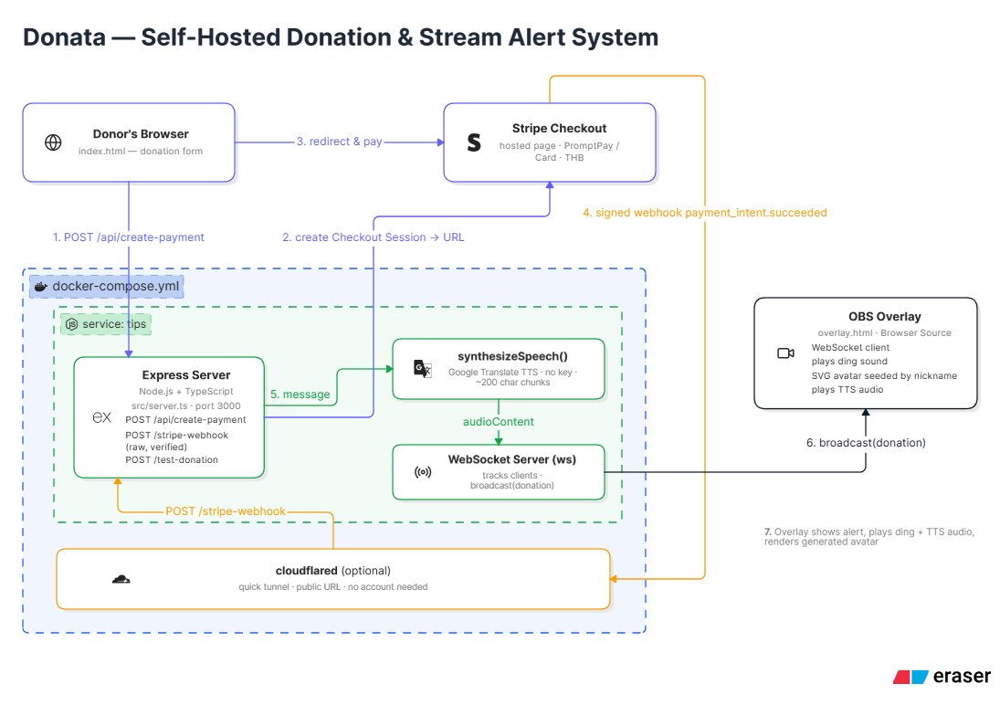

# Donata

<p align="center">
  <h3 align="center">Self-hosted Donation & Stream Alert System</h3>
</p>

<p align="center">
  <a href="https://github.com/gotzastory/donata/stargazers"></a>
  <a href="https://github.com/gotzastory/donata/blob/main/LICENSE"></a>
  <a href="https://github.com/gotzastory/donata/issues"></a>
</p>

## Table of Contents

- [Overview](#overview)
  - [Features](#features)
- [Architecture](#architecture)
- [Installation](#installation)
  - [Prerequisites](#prerequisites)
  - [Using Docker (recommended)](#using-docker-recommended)
  - [Local development (without Docker)](#local-development-without-docker)
- [Configuration](#configuration)
- [Stripe Webhook Setup](#stripe-webhook-setup)
- [Endpoints](#endpoints)
- [OBS Setup](#obs-setup)
- [Contributing](#contributing)
- [License](#license)

## Overview

Donata is a self-hosted donation system for streamers. Viewers donate via Stripe Checkout (PromptPay or card, THB), and each successful donation triggers a real-time alert on an OBS overlay — complete with a ding sound, a generated avatar, and the donation message read aloud via text-to-speech.

### Features

- **PromptPay & Card payments** via Stripe Checkout, priced in THB
- **Thai-localized donation page**
- **Real-time OBS overlay** driven by WebSocket, no polling
- **Text-to-speech**: donation messages are read aloud automatically (free, no API key — uses Google Translate's TTS endpoint, with a Web Speech API fallback)
- **Ding sound + generated avatar** on every alert (no image assets required)
- **Self-hosted**: full control over your data and infrastructure
- **Docker Compose** setup that includes an optional Cloudflare Tunnel service, so you can expose your local server publicly without configuring router port forwarding

## Architecture

- Backend: Node.js + Express + TypeScript (`src/server.ts`)
- Real-time layer: WebSocket server (`ws`) broadcasting donation events to connected overlays
- Frontend: static HTML/CSS/vanilla JS (`public/`) — donation form (`index.html`) and stream overlay (`overlay.html`)
- Payments: Stripe Checkout Sessions + webhook (`/stripe-webhook`)
- TTS: server-side synthesis via Google Translate's unofficial endpoint, played back in the overlay



## Installation

### Prerequisites

- Docker and Docker Compose
- A Stripe account (test mode is fine to start)
- Node.js 18+ and pnpm (only needed for local development outside Docker)

### Using Docker (recommended)

```bash
git clone https://github.com/gotzastory/donata
cd donata

cp .env.example .env
# fill in your Stripe keys in .env

docker compose up -d
```

This starts two containers:

- `tips` — the app, served on `http://localhost:3002`
- `cloudflared` — a Cloudflare Quick Tunnel exposing that port publicly (no account needed). The public URL is printed in its logs:
  ```bash
  docker compose logs cloudflared | grep trycloudflare.com
  ```
  The URL changes every time the stack restarts. If you need a stable URL, set up a [named Cloudflare Tunnel](https://developers.cloudflare.com/cloudflare-one/connections/connect-apps) with your own domain instead, or deploy to a VPS.

### Local development (without Docker)

```bash
pnpm install
pnpm dev      # ts-node-dev, auto-reload
pnpm build    # compile TypeScript
pnpm start    # run compiled output
```

## Configuration

Set these in `.env` (see `.env.example`):

| Variable | Description |
| --- | --- |
| `STRIPE_SECRET_KEY` | Stripe secret key (`sk_test_...` / `sk_live_...`) |
| `STRIPE_PUBLISHABLE_KEY` | Stripe publishable key |
| `STRIPE_WEBHOOK_SECRET` | Signing secret for the `/stripe-webhook` endpoint |
| `PORT` | Port the app listens on inside the container (default `3000`) |

In the [Stripe Dashboard → Payment methods](https://dashboard.stripe.com/settings/payment_methods), enable **PromptPay** and **Card** — the app doesn't hardcode payment methods, so Stripe dynamically shows whichever methods are enabled there.

## Stripe Webhook Setup

**Local development** — use the Stripe CLI, no public URL needed:

```bash
stripe listen --forward-to localhost:3002/stripe-webhook
```

This prints a `whsec_...` secret — put it in `STRIPE_WEBHOOK_SECRET`.

**Public / production** — in the [Stripe Dashboard → Webhooks](https://dashboard.stripe.com/webhooks):

1. Add endpoint → `https://<your-public-url>/stripe-webhook`
2. Listen for: `payment_intent.succeeded`
3. Copy the endpoint's signing secret into `STRIPE_WEBHOOK_SECRET`

## Endpoints

| Endpoint | Purpose |
| --- | --- |
| `/` | Donation form |
| `/overlay.html` | OBS Browser Source — add this URL as a Browser Source in OBS |
| `/api/create-payment` | Creates a Stripe Checkout session |
| `/stripe-webhook` | Stripe webhook receiver (signature-verified) |
| `/test-donation` | Fires a test alert to connected overlays (`POST`, optional JSON body `{ nickname, message }`) |

## OBS Setup

1. Add a **Browser Source**, URL: `http://localhost:3002/overlay.html` (or your public tunnel URL)
2. In the source's Properties, uncheck **Shutdown source when not visible** and **Refresh browser when scene becomes active** — otherwise OBS reloads the page and drops its WebSocket connection between scene switches
3. Test without a real payment:
   ```bash
   curl -X POST http://localhost:3002/test-donation \
     -H "Content-Type: application/json" \
     -d '{"nickname":"Test","message":"ทดสอบระบบ"}'
   ```

## Contributing

Contributions are welcome — feel free to submit a Pull Request.

## License

This project is licensed under the MIT License — see the [LICENSE](LICENSE) file for details.
